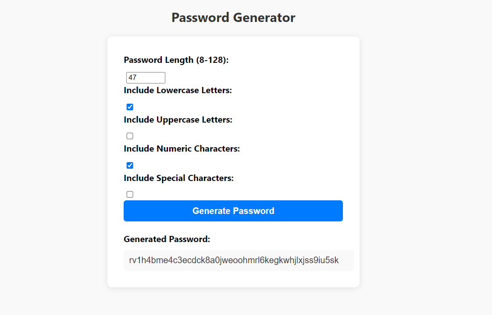

# passwordgenPlus
A simple web application that generates random passwords based on user-selected criteria. This application allows employees to create strong and secure passwords for accessing sensitive data.

## Features

- Randomly generates passwords with specified length and criteria.
- Allows users to choose the length of the password (between 8 and 128 characters).
- Provides options to include lowercase letters, uppercase letters, numeric characters, and special characters in the password.
- Validates user input to ensure a valid password length and at least one character type is selected.
- Displays the generated password in a user-friendly interface.
- Modern and responsive design with a polished user interface.

## Technologies Used

- HTML
- CSS
- JavaScript

## Usage

1. Open the `index.html` file in a web browser.
2. Specify the desired password length by entering a value between 8 and 128 in the "Password Length" input field.
3. Check the boxes for the character types you want to include in the password: lowercase letters, uppercase letters, numeric characters, and special characters.
4. Click the "Generate Password" button.
5. The generated password will be displayed in the "Generated Password" text box.
6. Copy the generated password and use it as needed for your secure access.

## Screenshot

## Contributing

Contributions are welcome! If you have any suggestions or feature requests, please open an issue or submit a pull request.

## License

This project is licensed under the [MIT License](LICENSE).
